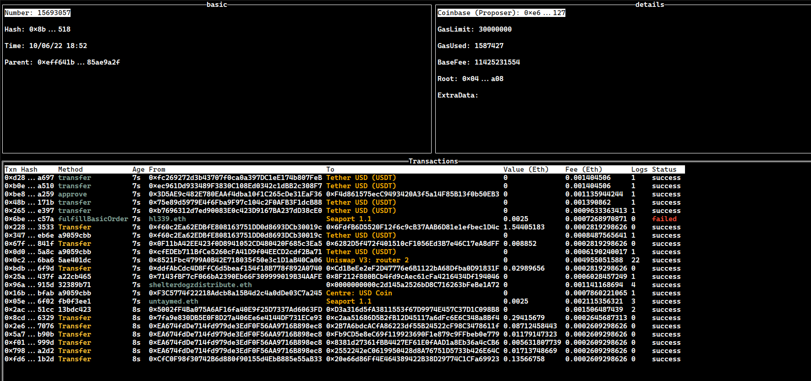

# ethscan

ethscan is a TUI Ethereum block explorer with the goal of providing a convenient
and useful alternative to web app explorers.

Inspired by the wonderful [k9s](https://github.com/derailed/k9s).

## Install

```
go install github.com/treethought/ethscan@latest
```

## Usage

### Configuration

Create a config file at `~/ethscan.yaml` (or somewhere else and pass it via `--config`).

Set an RPC URL (https:// or ws://) and an etherscan API key.

You can get a free RPC endpoint at https://quicknode.com.

```
rpc_url: YOUR_ENDPOINT
etherscan_key: YOUR_API_KEY
```

### Running

Currently only supports subscribing to blocks and inspecting them as they are received.

To get started simply run `etherscan` if using the binary, or `go run main.go`

## Screenshots

#### Blocks


#### Block Transactions



#### Transaction


